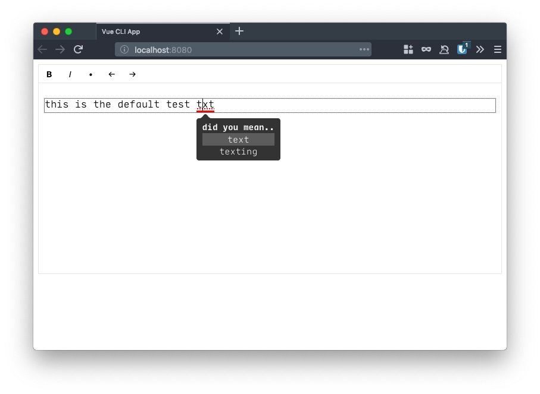

> For Vue.js 3.0 use version 3.X. All active development happens here.
> For Vue 2 use version 2.X. This version will recieve no more updates.
> How convenient!

# tiptap-editor

Vue component that contains our custom setup for the tiptap editor. Able to highlight phrases and give reasons/fixes to the warnings

```bash
npm i tiptap-editor
yarn add tiptap-editor
```



```js
<template>
  <TextEditor
	:value.sync="localtext"
	:warnings="warnings"
	:showMenu="true"
	:maxCharacterCount="200"
	height="500px"
	placeholder="write something will-ya!"
	id="some_unique_id"
  />
</template

<script>
import tiptapEditor from './tiptap-editor.vue';

export default {
	components: { tiptapEditor },
	data() {
		return {
			warnings: [],
			value: 'this is the initial value'
		}
	}
}

</script>
```

## Props

-   **value:** `String` - the text to edit

-   **placeholder:** `String` - the text to display when there is nothing in the editor

-   **warnings:** `[ Objects ]` - an array of text that should be warned about

    -   example:

        ```js
        [
            {
                value: 'the',
                message: 'did you mean...',
                options: ['too', 'pizza'], // optional
            },
            {
                value: 'test text',
                message: 'cannot say that, sorry',
                overrideClass: 'underlined-green', // optional
                offset: 32, // optional
                length: 9, // optional
            },
        ];
        ```

    -   Optional `offset` and `length` values can be specified to highlight a specific instance of an error.
        -   **offset:** `Number` - character distance from beginning of the text to the index of the error
        -   **length:** `Number` - character length of the error

-   **maxCharacterCount:** `Number` - Show a count of the current number of characters. If over the max the count will show red

-   **height:** `String` - height of the text editor, default is `300px`

-   **showMenu:** `Boolean` - if false, hide the format menu

-   **id:** `String` - give the editor a unique id. Also adds aria tags to link the editor menu to the text area


## Events

-   **update:value** - emitted whenever the core text value changes

-   **new-character-count** - the new internal character count of the value. This is useful since the synced value may have formatting, which internal is ignored when counting characters.

## Setup

-   clone this repo
-   `cd` into the repo directory and run `yarn install`
-   run `yarn serve`

## Available Scripts

-   `yarn serve` - start the dev server
-   `yarn build` - build for production
-   `yarn preview` - locally preview production build
-   `yarn format` - run Prettier to format code
-   `yarn validate:format` - run Prettier with `--check` flag
-   `yarn test` - run tests using vitest
